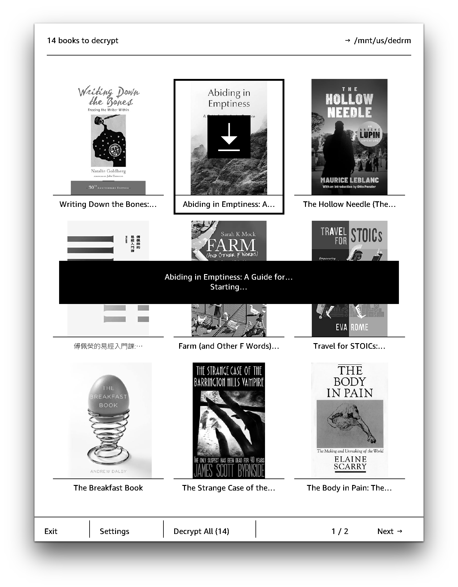
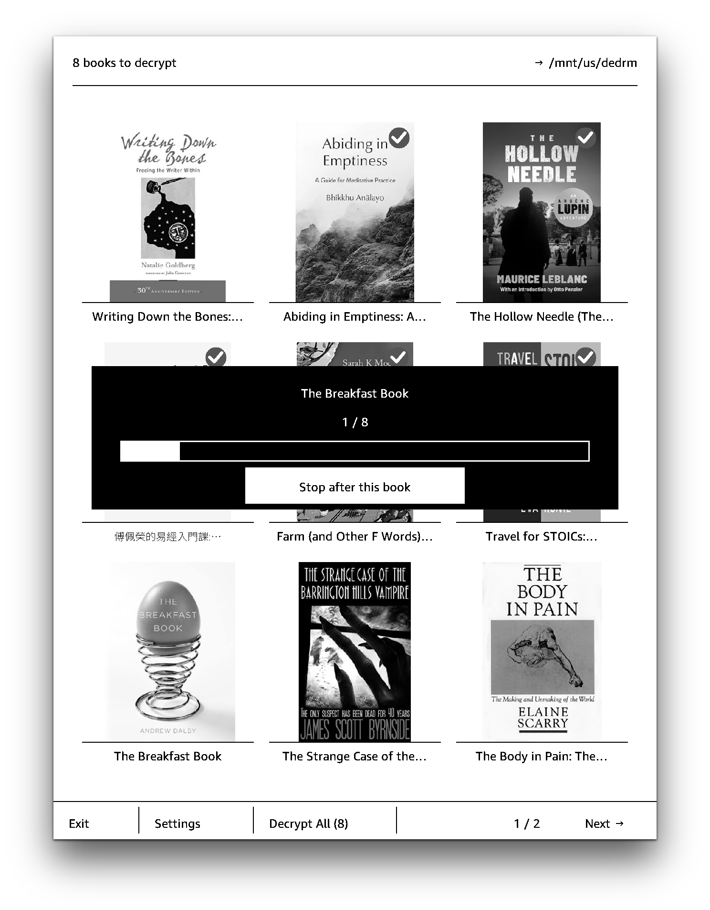

# kfxdedrm-fe 

A frontend for [kfxdedrm](https://github.com/Satsuoni/DeDRM_tools) on a jailbroken Kindle, now also a KOReader plugin, with capacity to convert KFX to EPUB on device.

## Build

```
git clone https://github.com/huangziwei/kfxdedrm-fe && cd kfxdedrm-fe/
rustup target add armv7-unknown-linux-musleabihf armv7-unknown-linux-musleabi
./build.sh          # hard-float, for the KOA2, Colorsoft and Scribe
./build.sh armsf    # soft-float, for the Paperwhite 2 generation
```

Both land in `device/extensions/kfxdedrm-fe/bin/` and `bin/launch.sh` runs whichever one starts, so a release zip carries the two and no one has to know their device's float ABI. Building just the one your Kindle needs is enough for a hand install.

## Install

### KUAL extensions and Scriptlet

Download and unzip the latest `kfxdedrm-fe-v<x.y.z>-kindle.zip` from the [release page](https://github.com/huangziwei/kfxdedrm-fe/releases), then copy:

| from | to | notes |
|:--|:--|:-- |
| `extensions/kfxdedrm-fe/` | `/mnt/us/extensions/kfxdedrm-fe/` | this exact path — the launcher and the settings file are hardcoded to it |
| `documents/KFXDeDRM.sh` | `/mnt/us/documents/KFXDeDRM.sh` | or anywhere you store your scriptlets |

`kfxdedrm` (for deDRM) and `bokai` (for format conversion) are not bundled. If they are not installed already, `kfxdedrm-fe` will prompt you at the first launch, you can tap `install` to fetch the latest version. Or if you skipped them, you can install and update them in the settings page. Format conversion is not on by default and you have to turn them on manually in settings.

### KOReader plugin

Download and unzip the latest `kfxdedrm-koplugin-v<x.y.z>-kindle.zip` from the [release page](https://github.com/huangziwei/kfxdedrm-fe/releases), then copy `kfxdedrm.koplugin` to `mnt/us/koreader/plugins`. 


## Screenshot

<p align="center">
    
    
</p>